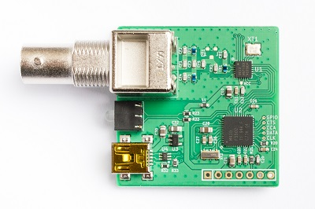
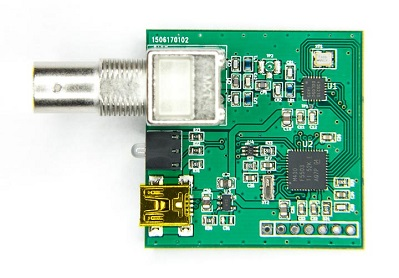

# dAISy USB Firmware Updates

This folder contains firmware updates for the *single channel* dAISy receivers, also known as [dAISy USB](https://shop.wegmatt.com/products/daisy-ais-receiver).

DO NOT try to install this firmware on other dAISy devices. There are currently no updates for dAISy 2+ and dAISy HAT.

## Firmware History

* **4.15** November 6 2021
  - Added support for Si4362-C2A radio IC.
  - Added support for MSP430F5502 MCU (HW version 4). Note separate firmware files!
  - Improved radio configuration for Si4467 and Si4362-C2A radios.
  - Fixed bug that discarded valid messages if CRC was followed by a stuff-bit.
  - Removed RSSI detect mode, it limited receiver sensitivity and range.
* **4.14** December 23 2017
  - Added smart channel hopping. This increases the number of received AIS messages by 40-60% compared to regular channel hopping.
  - Added support for NMEA loop-through of input from AUX serial. The enables forwarding of NMEA data, e.g. from a GPS receiver, to the connected PC.
  - Available only for [dAISy USB 3](https://shop.wegmatt.com/products/daisy-ais-receiver) (the ones sold in our store) and MSP430F5529 LaunchPad due to increased memory requirement.
* **4.12** July 1 2017
  - Minor optimization of radio configuration.
* **4.11** January 24 2017
  - Fixed bug to make dAISy work again with Android. This bug was introduced in version 4.10.
  - Slowed down channel hopping to twice per second. This improves the number of received messages by up to 25%.
  - Added command & to retrieve device serial number while in receive mode
  - Added support for input from AUX serial when enabled. However there still is no output of the debug menu on AUX serial.
* **4.08** May 30 2016
  - Added native support for Si4467 radio IC.
  - Added output of current configuration to debug menu.
  - Updated radio configuration for minor performance improvements.
* **4.07** March 13 2016
  - Fixed crash when receiving certain invalid AIS messages (endless loop spewing invalid AIS messages). 
  - Fixed crash when USB host goes into sleep (red LED blinking).
  - Added test mode that outputs a predefined AIS message every 5 second.
* **4.04** October 14 2015
  - Fixed reading channel configuration from FLASH memory.
  - Added debug option with TAB separated output for easier post processing of debug data.
* **4.03** September 6 2015
  - Finetuned crystal frequency to be closer to 30 MHz on average. Only minor improvement over 4.02, if any at all.
* **4.02** August 18 2015
  - Significantly improved reception of AIS messages over previous revisions. Greatly reduces number of errors, particularly for weak signals (below -80 dBm).

## Hardware Variants

There currently are 5 versions of the dAISy USB hardware. Make sure you download the right firmware for your version of dAISy!
Devices sold after August 2015 or running firmware 4.02 and newer will display their hardware and firmware version in the debug menu.

**hw4: dAISy USB 3 - square 2.1, MSP430F5502 MCU**

This is the version was introduced in November 2021 and [is currently sold in my store](https://shop.wegmatt.com/products/daisy-ais-receiver).
The first line of the debug menu says `dAISy USB 3 (5502)`
The MSP430 MCU is in a QFN package with the marking `M430 F5502`. Text on the back of the PCB says `dAISy USB 3`. 
Right-click *[here](https://github.com/astuder/dAISy/raw/master/Firmware/Daisy_hw4_fw4_15.txt)* and select *save link as* to download firmware version `4.15`.

**hw3: dAISy USB 3 - square 2, MSP430F5503 MCU**

This version was sold up to early 2021.
The first line of the debug menu says `dAISy USB 3 (5503)`
The MSP430 MCU is in a QFN package with the marking `M430 F5503`. Text on the back of the PCB says `dAISy USB 3`. PCB color and component arrangement varies, some being identical to the F5502 variant shown above.
Right-click *[here](https://github.com/astuder/dAISy/raw/master/Firmware/Daisy_hw3_fw4_15.txt)* and select *save link as* to download firmware version `4.15`.

**hw2: dAISy USB 2 - square 1, MSP430F5508 MCU**

This was the first version sold on Tindie (May, early June 2015). Note the MCU is in a QFP package (with leads). Text on the back says "dAISy USB 2".
PCB color can vary. Right-click *[here](https://github.com/astuder/dAISy/raw/master/Firmware/Daisy_hw2_fw4_11.txt)* and select *save link as* to download firmware version `4.11`.

**hw1: dAISy USB - the stick, MSP430F5508 MCU**

The first version, mostly sold during 2014. Text on the back says "dAISy USB". Only a few brave souls have these :)
Right-click *[here](https://github.com/astuder/dAISy/raw/master/Firmware/Daisy_hw1_fw4_11.txt)* and select *save link as* to download firmware version `4.11`.

**hw0: dAISyPack - BoosterPack for the MSP430F5529 LaunchPad**

For the tinkerers among us. Text on the back says "dAISyPack".
Right-click *[here](https://github.com/astuder/dAISy/raw/master/Firmware/Daisy_hw0_fw4_14.txt)* and select *save link as* to download firmware.

## Updating the Firmware

To update the firmware, you need the programming software from TI. It's part of a bigger package, but for your convenience I made the relevant executable available [here](http://www.adrianstuder.com/daisy/BSL_USB_GUI.zip) (sorry, Windows only)

If you are currently running a firmware version older than 4.0, you will also need to update dAISy's USB driver. Use [this driver](http://www.adrianstuder.com/daisy/daisyUSB%20inf%20v2.zip), when Windows prompts you for a new driver after the upgrade.

**Upgrade procedure**

1.	Download the correct firmware file for your version of dAISy (see above). Save it in a folder path without Unicode characters, for example c:\dAISy\

2.	Verify that the firmware file is a plain text file. The filename must end with .txt and the content of the file should start with text similar to this:
	~~~~
	@8000
    5F 14 21 83 82 93 86 27 09 24 92 83 86 27 82 93 
    84 27 0A 20 F2 F0 7F 00 23 02 0B 3C B2 40 80 BB 
	~~~~
	If the file is not plain text (e.g. has HTML formatting), download it again. Make sure to download the RAW file, not the Github web page.

3.	Connect to dAISy with a serial terminal program, like for example Putty.
	- The serial connection parameters are: baud rate 38400, data bits 8, parity none, stop bits 1 (8n1), flow control none
	- Select or enter serial port. The serial port of dAISy can be found in the Windows Device Manger under Ports.
	- If you are not familiar with terminal programs, see [this document](http://www.microsemi.com/document-portal/doc_view/130815-configuring-serial-terminal-emulation-programs) for detailed configuration steps.

4.	Put dAISy into boot loader mode by sending the follwing commands through the serial terminal:
	- Press *ESC* to enter the debug menu.
	- The menu will display the current firmware version on the first line. You can stop here if your dAISy already runs the latest firmware.
	- Press *B* to start the boot loader.
	
	dAISy will now disable the serial port and is ready for the firmware update.

5.	Close the terminal program.

6.	Start *BSL_USB_GUI.exe*.

7.	Press *Next*, accept agreement, press *Next*.

8.	Choose option *Select Firmware* and browse to the firmware file provided.
	
	**IMPORTANT**: *DO NOT* program dAISy with the LED and Echo examples, it will brick the device!

9.	The *Upgrade Firmware* button should be active and “Found 1 device” is displayed below the button.
	- If not, make sure dAISy is connected and you entered bootloader mode as described above.
	- If that does not work, connect dAISy directly to your computer without a USB hub and try again.
	
10.	Press Upgrade Firmware.
	
	The upgrade should only take a few seconds.
	If the firmware upgrade fails with an error, make sure you use the correct firmware file.
	After a failed firmware update, dAISy will usually start in bootloader mode after a power-cycle. Retry this procedure starting
	at step 6.

11.	After successful upgrade, dAISy should be available again.

	In some cases you might need to disconnect and reconnect dAISy.

12.	The version information in the debug menu should now read:

	*dAISy USB v4.xx* followed by hardware information, e.g. *dAISy USB 3 (5503)*

If you bricked dAISy in the process of upgrading it, you can try to revive it following the instructions on [this page](./unbrick-daisy.md).
	
Please let me know if you run into any problems. Also don't hesitate to contact me if this all sounds too complicated, you don't have a Windows machine,
and/or don't have a resident geek to ask for help.

I also offer to perform free firmware upgrades if you cover the shipping cost.
