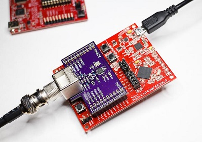

Breakout board for the Si446x as MSP430 BoosterPack. 

Paired with a [TI MSP430F5529 LaunchPad](https://www.ti.com/tool/MSP-EXP430F5529LP), this board can also be used with the (closed source) [dAISy USB firmware](https://github.com/astuder/dAISy/tree/master/Firmware).

This breakout board is also the basis of [this project](https://github.com/NSwiz1/msp430-si4467-ais-audio-receiver), which uses the Raw or Sync data from the Si446x for audio input into ShipPlotter software.
